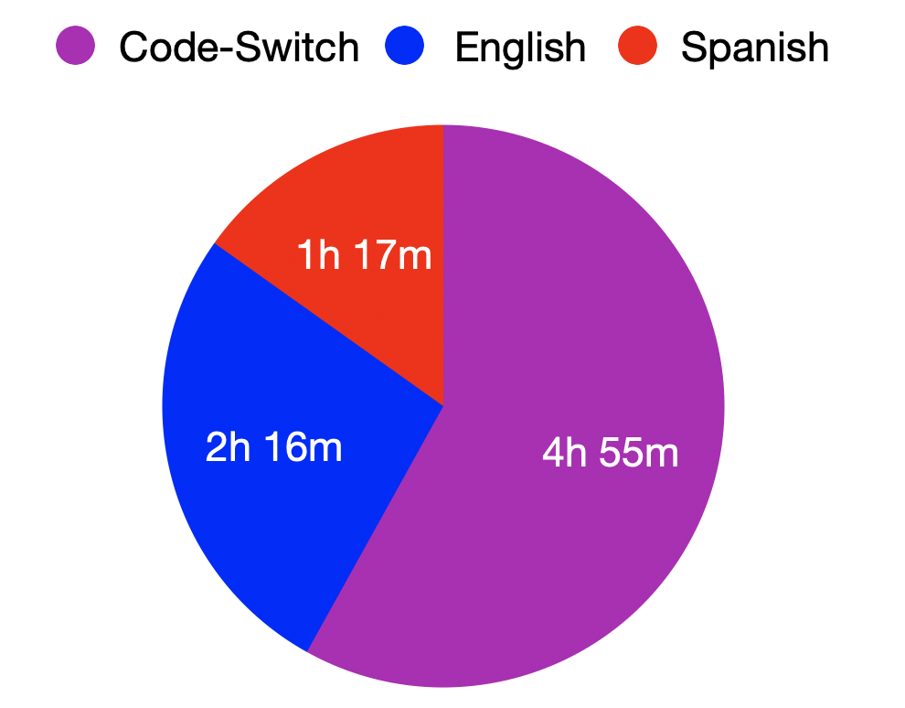

# Adapted Miami Corpus for Speaker Diarization

## Dataset Overview
This dataset is derived from the [Bangor Miami Corpus](http://bangortalk.org.uk/speakers.php?c=miami), a Spanish-English code-switching dataset. It includes 8.5 hours of annotated audio across 23 tracks, featuring 36 unique speakers. Some tracks have been adapted to be monolingual by excluding code-switching segments. Below is a breakdown of the minutes of Spanish and English monolingual segments versus Spanish-English code-switch segments.

## Contents

- **Reference RTTM Files**: Annotation files containing speaker diarization labels.
- **Audio Files**: link to audio files on [one drive](https://onedrive.live.com/?id=DD72E4A05B8E96B0%21609&cid=DD72E4A05B8E96B0)
- **Transcription Files**: The `.tr` files include speaker labels, timestamps, and language labels. Although they also contain transcriptions of the spoken content, these should not be considered accurate since the removal of audio segments has led to some discrepancy between the text and the spoken words.

## Access
The dataset is made publicly available.

## Links
link to audio files: https://onedrive.live.com/?id=DD72E4A05B8E96B0%21609&cid=DD72E4A05B8E96B0
Bangor Miami Corpus source: http://bangortalk.org.uk/speakers.php?c=miami